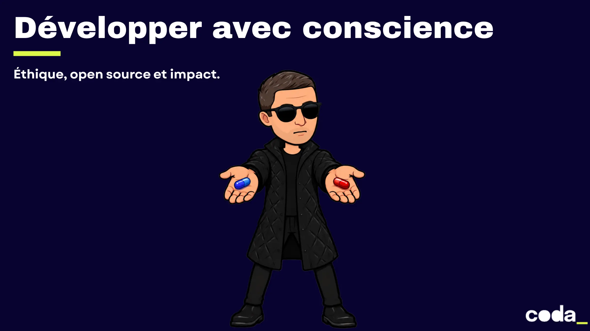

# Développer avec conscience : éthique, open source et impact



## Démarrer

```bash
npm install
npm run dev      # présentation sur http://localhost:3030
npm run build    # version statique dans dist/
npm run export   # export PDF (nécessite playwright-chromium)
```

## Structure

```
slides.md              # couverture, programme, objectifs + import des séquences
pages/                 # une page par séquence (00 à 06)
components/            # composants neobrutal réutilisables
layouts/section.vue    # slide d'ouverture de séquence
styles/index.css       # thème neobrutal (couleurs, bordures, ombres)
public/images/         # images optimisées en WebP (inr/, ethics/, tarot/)
```

## Images et licences

- `public/images/inr/` : visuels de l'Académie NR, sous licence **CC BY-NC-ND 4.0**. Ils sont repris sans modification (conversion WebP et redimensionnement uniquement) et la source est créditée sur chaque slide avec `<Source inr />`. Ne pas les recadrer ni les retoucher.
- `public/images/ethics/` : visuels du support « Developers ethics ».
- `public/images/tarot/` : cartes du [Tarot de la Tech](https://tarotcardsoftech.artefactgroup.com/) d'Artefact.
- `public/images/craftsman-*.webp` : infographie *The Software Craftsman*.